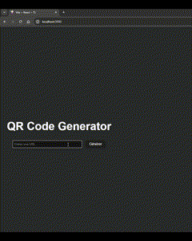

# QuickQR - QR Code Generator

A simple web application to generate QR codes from URLs, built with a React frontend and a Flask backend, containerized using Docker.

## Demo



## Table of Contents

- [Tech Stack](#tech-stack)
- [Project Structure](#project-structure)
- [Setup and Installation](#setup-and-installation)
- [Usage](#usage)
- [API Endpoint](#api-endpoint)
- [Features](#features)

## Tech Stack

-   **Frontend:** React, Axios, Tailwind CSS (optional, depending on final UI implementation)
-   **Backend:** Python, Flask, Flask-CORS, Flask-Limiter, qrcode[pil]
-   **Containerization:** Docker, Docker Compose

## Project Structure

```
quick-qr/
├── backend/
│   ├── app.py          # Flask application logic
│   ├── Dockerfile      # Dockerfile for the backend
│   ├── requirements.txt # Python dependencies
│   └── README.md       # Backend specific README
├── frontend/
│   ├── src/            # React source code
│   │   └── App.tsx      # Main React component 
│   │   └── ...         # Other components
│   ├── Dockerfile      # Dockerfile for the frontend
│   ├── package.json    # Node dependencies
│   └── .env.docker     # Environment variables for Docker container
│   └── ...             # Other frontend files (index.html, vite.config.js etc.)
├── docker-compose.yaml # Docker Compose configuration file
└── README.md           # This file
```

## Setup and Installation

1.  **Prerequisites:**
    * Docker installed and running.
    * Docker Compose installed.

2.  **Clone the Repository (if applicable):**
    ```bash
    git clone <your-repository-url>
    cd quick-qr
    ```

3.  **Build and Run Containers:**
    Open a terminal in the project's root directory (where `docker-compose.yaml` is located) and run:
    ```bash
    docker-compose up --build -d
    ```
    * `--build`: Forces Docker to rebuild the images if the Dockerfiles or related files have changed.
    * `-d`: Runs the containers in detached mode (in the background).

## Usage

-   **Frontend:** Access the QR code generator interface by navigating to `http://localhost:3000` in your web browser (assuming the default port mapping in `docker-compose.yaml`).
-   **Backend:** The backend API is available at `http://localhost:8080`.

## API Endpoint

### Generate QR Code

-   **URL:** `/generate`
-   **Method:** `GET`
-   **Query Parameters:**
    -   `url` (string, required): The URL to encode into the QR code.
-   **Success Response:**
    -   **Code:** `200 OK`
    -   **Content-Type:** `image/png`
    -   **Body:** The QR code image data.
-   **Error Responses:**
    -   **Code:** `400 Bad Request` - If the `url` parameter is missing.
        ```json
        {"error": "URL query parameter is required"}
        ```
    -   **Code:** `429 Too Many Requests` - If the rate limit is exceeded.
        ```json
        {"error": "Rate limit exceeded: <limit>"}
        ```
    -   **Code:** `500 Internal Server Error` - If an error occurs during QR code generation.
        ```json
        {"error": "Failed to generate QR code"}
        ```
-   **Example Request (using curl):**
    ```bash
    curl -o qrcode.png "http://localhost:8080/generate?url=https%3A%2F%2Fwww.google.com"
    ```

## Features

-   Generate QR codes from user-provided URLs.
-   Simple web interface for input and display.
-   Backend API endpoint for QR code generation.
-   Basic rate limiting on the backend API to prevent abuse (2 requests per minute per IP).
-   Cross-Origin Resource Sharing (CORS) enabled for the frontend origin.
-   Containerized using Docker for easy setup and deployment.

